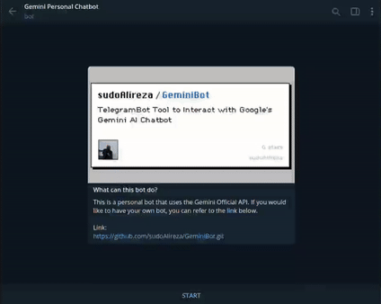

# GeminiBot - Personalized Telegram Bot

GeminiBot is a Telegram bot tailored to chat with Google's Gemini AI chatbot. Leveraging the official Gemini Bot on the Telegram platform, it engages users in dynamic conversations.


## Getting Started

### Prerequisites

Before deploying the bot, ensure you have the following:

- Python 3.10 installed on your system
- Obtain a [Telegram API token](https://core.telegram.org/bots) from BotFather
- Acquire a [Gemini API key](https://makersuite.google.com/app/apikey) from the Google Gemini website
- Get your Telegram Account id from [Show Json Bot](https://t.me/ShowJsonBot). Account id is different than Account username and you should set it in `.env` file to restrict GeminiBot to your account.

##
<p align="center" width="100%">

</p>

### Installation

1. Clone the repository:

   ```bash
   git clone https://github.com/sudoAlireza/GeminiBot.git
   ```

2. Navigate to the project directory:

   ```bash
   cd GeminiBot
   ```

3. Install the required dependencies:

   ```bash
   pip install -r requirements.txt
   ```

### Configuration

1. Create a file named `.env` in the project root and add your Telegram bot API token and Gemini API key:

   ```dotenv
   TELEGRAM_BOT_TOKEN=<Your Telegram Bot Token>
   GEMINI_API_TOKEN=<Your Gemini API key>
   AUTHORIZED_USER=<Your Telegram account ID number>
   ```

2. Update the `safety_settings.json` file with appropriate safety settings for Gemini policies.

### Usage

Run GeminiBot using:

```bash
python main.py
```

## Features

- Engage in online conversations with Google's Gemini AI chatbot
- Maintain conversation history for continuing or initiating new discussions
- Send images with captions to receive responses based on the image content. For example, the bot can read text within images and convert it to text.


## To-Do

- [ ] **Removing Specific Conversation from History**
- [ ] **Add Conversation Feature to Images Part**
- [ ] **Handle Long Responses in Multiple Messages**
- [ ] **Add Tests and Easy Deployment**


## Documentation

For detailed instructions on using Telegram bots, refer to the [Telegram Bots Documentation](https://core.telegram.org/bots).

To begin with Gemini, refer to the [Gemini API: Quickstart with Python](https://ai.google.dev/tutorials/python_quickstart).


## Security

Ensure the security of your API keys and sensitive information. Follow best practices for securing API keys and tokens.

## Contributing

Contributions to GeminiBot are encouraged. Feel free to submit issues and pull requests.